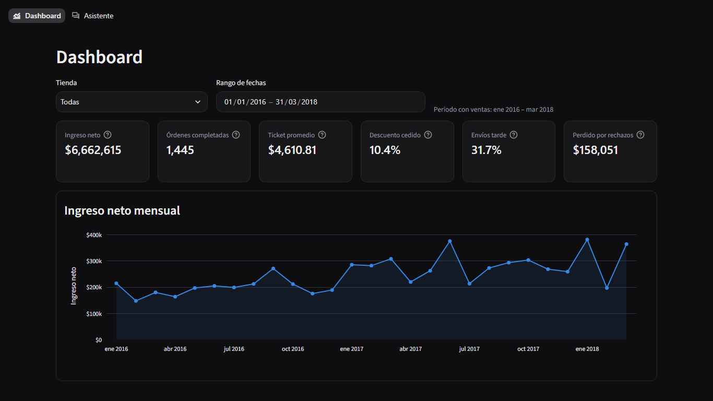
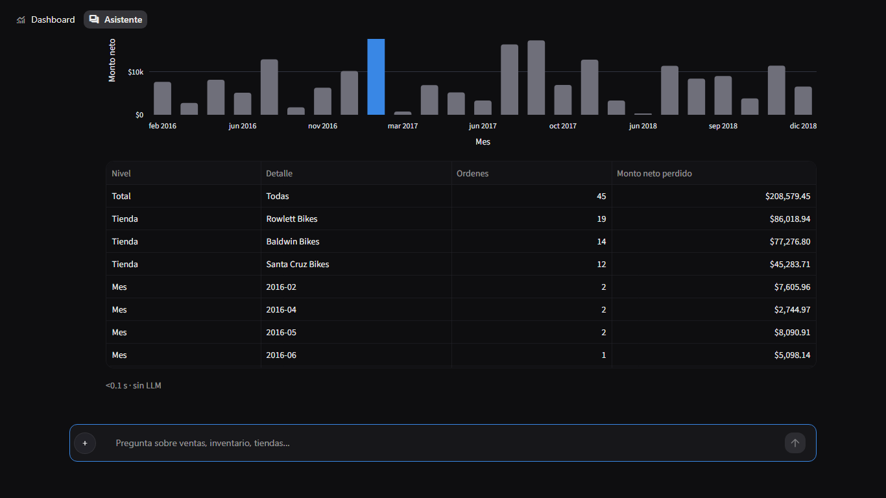

# Fase 3: analytics.py + app.py + tema visual

**Objetivo:** una aplicación Streamlit con dos páginas, Dashboard y Asistente, sobre
la misma SQL verificada de la Fase 2, con un tema oscuro sobrio y verificada con
pruebas automáticas y capturas revisadas a 1366 px y 390 px.

```bash
streamlit run app.py
```

---

## 1. Dependencias (Python 3.14)

| Paquete | Versión | Estado |
|---|---|---|
| streamlit | 1.64.0 | Instalado; `AppTest`, `st.navigation(position="top")` y `st.segmented_control` funcionan |
| plotly | 7.1.0 | Instalado; serializa figuras sin problemas |
| playwright | 1.63.0 + Chromium | Instalado; solo se usa para las capturas (dependencia de desarrollo) |
| pyarrow | 25.0.1 | Llega con streamlit; hay rueda para 3.14 |

**No falló ninguna rueda.** `requirements.txt` separa las dependencias de ejecución
(pandas, ollama, sqlglot, streamlit, plotly) de las de desarrollo (pytest, playwright).

---

## 2. Arquitectura

```
app.py                 set_page_config, CSS, verificación de la BD, st.navigation (arriba)
views/dashboard.py     página Dashboard
views/asistente.py     página Asistente
ui/charts.py           plantilla Plotly propia, gráficos de N1–N10, gráfico automático, formato de tablas
ui/data.py             lecturas con st.cache_data (claves: tienda + fechas ISO)
analytics.py           KPIs, tendencia, need(), insight(); sin Streamlit
db.py                  conexión de solo lectura (mode=ro + query_only) y tiempo máximo
.streamlit/config.toml tema oscuro
assets/style.css       menú/footer/Deploy ocultos, ancho de 1200 px, tarjetas, botón "+"
tools/capturas.py      capturas con Playwright; tools/medir_chat.py mide la alineación del "+"
```

**Decisiones:**
- **`st.navigation` con `position="top"`** y dos páginas de archivo. Así `st.chat_input`
  queda fijo abajo en el Asistente, cosa que dentro de tabs no ocurre. En móvil,
  Streamlit convierte la barra superior en el botón `»`.
- **Una sola fuente de SQL.** `analytics.need(n)` envuelve `run_business_query` sin
  límite de filas, y el chat usa la misma función con `LIMIT 500`. Por eso N7
  muestra 1,064 filas en el dashboard y 500 en el chat.
- **Solo lectura en todas partes**, a través de `db.ro_connect`, incluidos los KPIs
  y la tendencia.
- **Sin BD al arrancar:** la app muestra `st.error` con el comando
  `python database_builder.py` y se detiene (hay prueba).

---

## 3. analytics.py

| Función | Detalle |
|---|---|
| `default_period()` | `min_order_date` → `last_completed_date`, es decir, 2016-01-01 → 2018-03-31 |
| `get_kpis(store, from, to)` | Ingreso neto, órdenes completadas, ticket promedio, % de descuento cedido, % de envíos tarde e ingreso perdido por rechazos. Cada uno trae `delta` contra el **periodo anterior de igual duración** (`previous_period`), expresado en % o en pp según el KPI; es `None` si ese periodo empieza antes de los datos o su valor es 0 |
| `monthly_revenue(...)` | Columnas mes, ingreso_neto y ordenes (solo completadas) |
| `need(n, **filtros)` | Resultado completo de la necesidad N1–N10 |
| `insight(n, df)` | Una frase determinística con la cifra principal, sin LLM. También es la respuesta de plantilla del chat cuando Ollama está apagado y el ancla de la síntesis para las consultas verificadas |

**Cifras con los filtros en NULL** (coinciden con fase2.md; lo prueba `tests/test_analytics.py`):
ingreso neto completado $6,662,615.24 (bruto $7,438,010.06 − cedido $775,394.82),
1,445 órdenes, ticket de $4,610.81, 10.4 % de descuento y 31.7 % de envíos tarde (458/1,445).

**Matiz del periodo por defecto:** el KPI "Perdido por rechazos" muestra **$158,050.68**,
no los $208,579.45 de N10, porque el periodo con ventas termina el 2018-03-31 y hay
$50,528.77 de rechazos posteriores. El texto de ayuda del KPI lo indica y el
selector de fechas permite extender el rango hasta el 2018-12-28, en cuyo caso el
KPI vuelve a coincidir con N10 (hay prueba).

---

## 4. Tema visual

- **config.toml:** `base="dark"`, fondo `#0e0e10`, superficies `#17171a`, texto `#ececec`,
  un único acento `#3987e5`, radio de 12 px y fuente sans-serif del sistema. El CSS
  pide primero Inter y cae a la fuente del sistema, sin descargar nada.
- **style.css:** oculta el menú, el footer, el botón Deploy y el widget de estado;
  limita el contenido a 1200 px (también la barra del chat); tarjetas y KPIs con borde
  de 1 px `rgba(255,255,255,.08)`, radio de 12 px y sin sombras.
- **Plotly:** plantilla propia `bikestores` (`ui/charts.py`), compartida por los 11
  gráficos del dashboard y por el chat.
  - Paleta **validada** con el script de la guía de visualización contra la superficie
    `#17171a`: acento `#3987e5`, gris `#6f6f7a` para "el resto" (contraste ≥ 3:1) y
    naranja `#d95926` como segunda categoría en N6 (ΔE CVD 26.8, ΔE normal 31.8).
  - Rankings en barras horizontales ordenadas; el elemento destacado va en acento y
    el resto en gris.
  - Moneda: eje abreviado (`$500k`, `$1.5M`) para que sea legible a 390 px, y cifra
    completa en la etiqueta de la barra y en el tooltip (`$1,430,619`).
  - Fechas del eje en español (`ene 2016`). Plotly no trae el locale "es" dentro de
    Streamlit, así que el eje es categórico con etiquetas propias.
  - Sin arcoíris, sin 3D y sin pies.

### Gráficos por necesidad

| ID | Gráfico | Destacado |
|---|---|---|
| N1 | Top 10 productos por ingreso neto con descuento | El 1.º |
| N2 | Casos producto·tienda por stock; el stock 0 se dibuja con un trazo mínimo y la etiqueta "agotado" | Agotados en azul |
| N3 | Vendedores por ingreso en Electric Bikes | El 1.º |
| N4 | **% del ingreso de cada ciudad hecho con el descuento mínimo** (columna nueva `pct_ingreso_desc_minimo`) | La mayor proporción; el insight menciona también al líder en monto |
| N5 | **"Valor de órdenes entregadas tarde"** por tienda (no "costo") | La tienda con más valor |
| N6 | Top 15 por valor inmovilizado, con color por estado: "Nunca vendido" (azul) y "Sin ventas recientes" (naranja), con leyenda | — |
| N7 | Clientes por máximo de marcas en una orden | La barra mayor |
| N8 | Ticket promedio por tienda | El mayor |
| N9 | Rotación mensual; `segmented_control` Categoría/Marca | La más lenta |
| N10 | Monto perdido por mes (una etiqueta cada k meses) | El peor mes |

**Gráfico automático del chat:** 1 categoría + 1 número da barras; mes/fecha + número
da una línea; cualquier otra forma, ninguno. Si la respuesta viene de una consulta
verificada, se usa el mismo gráfico del dashboard.

---

## 5. Página Dashboard

- **Barra superior:** tienda (Todas + 3), rango de fechas (por defecto el periodo con
  ventas, extensible hasta el 2018-12-28) y el texto "Periodo con ventas: ene 2016 – mar 2018".
- **6 `st.metric`** con delta. `delta_color="inverse"` en los KPIs donde subir es malo
  (descuento, envíos tarde, rechazos). La ayuda de cada KPI explica la fórmula y el
  periodo comparado. En móvil los KPIs van de 2 en 2.
- **Tendencia** mensual del ingreso neto.
- **Secciones:** Rentabilidad (N1, N4, N7, N8) · Operación e inventario (N2, N5, N6, N9) ·
  Personal (N3) · Riesgo (N10). Cada tarjeta tiene título con ícono de ayuda (la
  `definicion`), insight, gráfico y un expander "Ver datos" con la tabla formateada
  ($ y %) y el botón "Descargar CSV".

## 6. Página Asistente

- **Encabezado:** selector de modelo (`SUPPORTED_MODELS` más los modelos locales) con
  indicador `● listo` / `↓ no descargado` / `○ Ollama apagado`. El estado se cachea
  10 s en la sesión para no bloquear cada rerun con el ping de 2 s.
- **Cambio de modelo:** `unload_model(anterior)`, descarga con `st.progress` usando el
  porcentaje de `pull_model` si hace falta, reinicio de la conversación (mensajes e
  historial) y el toast "Modelo X activo; conversación reiniciada".
- **Ollama apagado:** banner con el botón "Iniciar Ollama" (`try_start_server`). Las
  preguntas que el enrutador resuelve con SQL verificada siguen funcionando: la
  síntesis cae a la plantilla `analytics.insight`, algo que cubre una prueba.
- **Estado vacío:** saludo más 4 sugerencias: 2 necesidades, 1 con filtro
  ("Ticket promedio por tienda en 2017") y 1 libre.
- **Cada respuesta** muestra el texto ejecutivo; el distintivo de origen (Verificada /
  IA anclada / Generada por IA) con chips de filtros aplicados o adaptados; un
  expander "SQL"; el gráfico automático; la tabla formateada; y un caption con el
  tiempo y el modelo ("sin LLM" si no se usó).
- **Mientras responde:** `st.status` con "Generando consulta…" y luego "Analizando
  resultados…". Para mostrar las dos fases, la página llama a `answer_question` sin
  síntesis y después a `synthesize`.
- **Botón "+"**: `st.container(key="plus")` con posición fija por CSS. Al hacer clic
  muestra `st.toast("Próximamente")` y nada más. La alineación se **midió** con
  `tools/medir_chat.py`:

  | Viewport | Centro de la caja | Centro del "+" | Desfase |
  |---|---|---|---|
  | 1366×768 | 683.0 | 683.5 | +0.5 px |
  | 390×844 | 759.0 | 759.5 | +0.5 px |
  | 1920×1080 | 995.0 | 995.5 | +0.5 px |

  En escritorio el texto tiene `padding-left` para que el "+" no lo tape. En móvil la
  caja de Streamlit pone el texto arriba y los botones abajo, así que el "+" queda en
  la fila de los botones, a la altura del de enviar, y no hace falta sangría.

---

## 7. Verificación

**`pytest -q`: 242 passed** (todas las fases, medido al cerrar la Fase 3 junto con los cambios de la Fase 4).

- `tests/test_analytics.py`: KPIs con filtros NULL contra las cifras de fase2.md, KPIs con
  el rango completo contra el total de N10, las 10 necesidades devuelven filas y un insight
  real, need() sin límite, el filtro de tienda reduce los totales, el periodo anterior de
  igual duración, el delta calculado a mano, los ejemplos de insight y la conexión de solo lectura.
- `tests/test_app.py` (AppTest, con backend de Ollama y LLM falsos): ambas páginas cargan sin
  excepción; el dashboard muestra 6 KPIs y 11 gráficos; el filtro de tienda cambia los KPIs;
  una pregunta muestra respuesta, distintivo, SQL y tabla; una consulta verificada funciona
  con Ollama apagado; el cambio de modelo vacía mensajes e historial, descarga el modelo
  nuevo, libera el anterior y lanza el toast; el "+" lanza "Próximamente"; y sin BD aparece
  el error con el comando.

### Capturas (docs/capturas/)

Se tomaron con `python tools/capturas.py` (Playwright y Chromium) con la app corriendo.
Las versiones "completo" agrandan el viewport al alto del contenido, porque Streamlit
desplaza un contenedor interno y `full_page` no lo captura.

| Archivo | Contenido |
|---|---|
| `dashboard_desktop.png` / `dashboard_desktop_completo.png` | Dashboard a 1366×768 |
| `dashboard_movil.png` / `dashboard_movil_completo.png` | Dashboard a 390×844 |
| `asistente_desktop.png` / `asistente_movil.png` | Estado vacío |
| `asistente_desktop_respuesta*.png` / `asistente_movil_respuesta*.png` | Chat con una respuesta verificada |




### Problemas encontrados al revisar las capturas y cómo se corrigieron

| Problema | Corrección |
|---|---|
| Las capturas salían con los esqueletos de carga | Se espera al número de gráficos Plotly o al contenido esperado y a que no quede ningún `stSkeleton` |
| `full_page` solo capturaba el viewport | Se agranda el viewport al `scrollHeight` del contenedor principal |
| Etiquetas de KPI cortadas ("Órdenes enviadas t…") | Etiquetas más cortas ("Envíos tarde", "Perdido por rechazos") y salto de línea permitido |
| "Periodo con ventas" y "● listo" desalineados con los controles | Clase `inline-note` alineada al centro del control |
| El "+" quedaba 14.6 px por debajo del centro del chat | Se calculó `bottom` con la geometría medida (margen de 56 px y alto de 57 px); ahora el desfase es de 0.5 px en los 3 anchos |
| Fechas del eje en inglés ("Jan 2016") y último punto recortado | Eje categórico con etiquetas en español y rango con margen |
| Eje de moneda encimado a 390 px (`$500,000$1,000,000`) | Formato abreviado (`$500k`) con 5 marcas |
| Stock 0 invisible en N2 (barra de largo 0) | Trazo mínimo en azul con la etiqueta "agotado" |
| El texto de N4 destacaba otra ciudad que el gráfico | El insight usa el mismo criterio (proporción) y menciona al líder en monto |
| Tablas sin formato (`1430618.99`) | `column_config` con `dollar`, `%` y miles |
| Avatares del chat en rojo y naranja, fuera de la paleta | Íconos Material neutros |
| El saludo seguía visible sobre la primera pregunta | La entrada se lee antes de dibujar el estado vacío |
| La síntesis de qwen describía la estructura de la tabla ("categorías Todas/Tienda/Mes") | En las consultas verificadas se pasa el hallazgo determinístico como ancla de la síntesis |
| 27 meses amontonados en N10 | Una etiqueta cada k meses, sin rotación |

---

## 8. Problemas conocidos

- **Latencia en esta máquina (solo CPU, sin GPU), con qwen2.5:1.5b:** una respuesta
  verificada tarda **0.1 s** (frase determinística; `config.VERIFIED_SYNTHESIS = False`
  desde la Fase 4) o unos **11–12 s** si se activa "Redacción con IA". Una generada por
  IA tarda **12.4 s** de mediana y una anclada **14.8 s**. Ver la tabla p50/p95 en
  fase2.md §5.4. El `st.status` deja claro que la app está trabajando.
- **La primera respuesta** tras abrir la app o cambiar de modelo paga la carga del modelo
  en RAM (unos 15–20 s adicionales).
- **Con el periodo por defecto, N6 solo muestra "Nunca vendido"**: con la ventana de 6
  meses no existe ningún "Sin ventas recientes" (ver fase2.md). Si se elige un rango más
  corto, aparece la segunda categoría en naranja.
- **La síntesis de un modelo de 1.5B puede ser torpe** con tablas de varias partes (N1,
  N5, N9, N10), aun con el ancla. La cifra principal viene del insight determinístico y
  la tabla siempre se muestra.
- **Los filtros del dashboard y del chat son independientes**: el chat no hereda la tienda
  ni las fechas elegidas en el dashboard.
- **Accesibilidad:** la identidad nunca depende solo del color (etiquetas directas,
  leyenda en N6 y la tabla en "Ver datos"). No se hizo una auditoría formal con lector de
  pantalla.
- **En móvil** la navegación se abre con el botón `»` (comportamiento nativo de
  Streamlit con `position="top"`).
