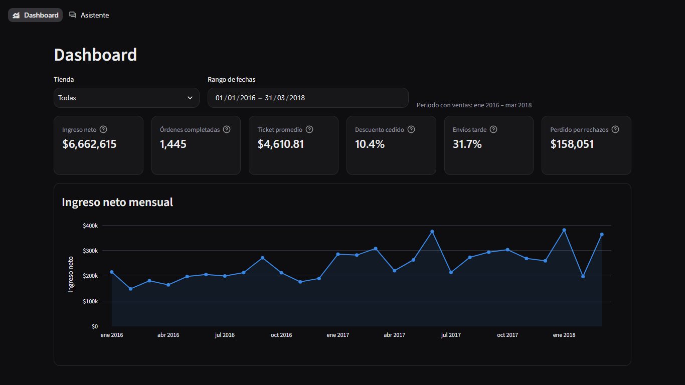

# Fase 4: arranque en un clic y cierre del proyecto

**Objetivo:** que alguien que nunca vio el proyecto lo arranque con un doble clic
(`ejecutar.bat`) o con `./ejecutar`, con la lógica en Python (`bootstrap.py`) y los
scripts como envoltorios mínimos. Todo verificado de extremo a extremo en Windows y
en Linux.

---

## 0. Pendientes de la Fase 3

- **fase3.md:** marcadores rellenados con cifras reales. `pytest -q` da 242 passed en
  ese momento. Latencias: respuesta verificada de 0.1 s (o 11–12 s con "Redacción con
  IA"), generada por IA de 12.4 s y anclada de 14.8 s, medianas con qwen.
- **fase2.md §5.4** ya tenía la evaluación real con p50/p95; se completó con la tabla de
  latencia por ruta, la recomendación de modelo (§5.5), los fallos reales (§8) y la
  Fase 2B (§10).
- **Ajuste condicional aplicado:** la p50 de una respuesta verificada con síntesis era
  **11.0 s** en la evaluación, por encima del umbral de 8 s. Por eso:
  - `config.VERIFIED_SYNTHESIS = False` (por defecto). `sql_engine.answer_question` y el
    Asistente responden las consultas verificadas con `analytics.insight`, sin llamar al LLM.
  - En el Asistente aparece un toggle **"Redacción con IA"** para activar la síntesis.
    Hay pruebas del toggle, de la opción `verified_synthesis=True` y del camino sin LLM.
  - **Antes y después** (`tools/medir_sintesis.py`, las 10 preguntas de negocio, qwen, CPU):

    | Configuración | p50 | p95 (máx. de 10) |
    |---|---:|---:|
    | Con síntesis del LLM (antes) | 12.0 s | 18.5 s |
    | Sin síntesis, frase determinística (después, por defecto) | **0.13 s** | 0.19 s |

## 1. Correcciones encontradas durante esta fase

| Problema | Hallazgo | Corrección |
|---|---|---|
| **`localhost` lento en Windows** | Ollama solo escucha en `127.0.0.1`. Conectarse a `localhost` prueba primero `::1` y espera **~2.1 s** en cada conexión nueva (medido: 2.11 s frente a 0.02 s). `is_server_up` tiene un límite de 2 s y tardaba 2.4 s, así que podía reportar "Ollama apagado" en falso, y cada chequeo del arranque pagaba 2 s | `config.OLLAMA_HOST` y `bootstrap.py` usan `http://127.0.0.1:11434` por defecto. La síntesis no mejoró de forma medible (12.0 s frente a 13.6 s, dentro del ruido), porque el cliente reutiliza la conexión |
| **"$" interpretado como LaTeX** | Una respuesta con dos montos ("$208,579.45 … $86,018.94") se mostraba como fórmula | El Asistente escapa `$` al mostrar el texto; hay prueba |
| **Carpeta `Data` con mayúscula** | En Windows funcionaba, pero en Linux `config.DATA_DIR = data/bike_stores` no la encontraba | Se renombró a `data/`; la prueba en Linux lo confirma |
| **Ctrl+C no cerraba limpio en Windows** | `app.wait()` bloqueante no atiende señales; Ctrl+Break y el cierre de ventana llegan como `SIGBREAK` | Espera con `poll()` cada 0.5 s y manejador de `SIGBREAK` que lanza `KeyboardInterrupt`; el `finally` cierra Streamlit |

---

## 2. Diseño

```
ejecutar.bat / ejecutar / ejecutar.sh   ← envoltorios mínimos: encuentran Python ≥ 3.10
        │
        ▼
bootstrap.py  (solo biblioteca estándar; corre antes de instalar nada)
  [1/5] Entorno        .venv + pip install -r requirements.txt solo si cambió su hash (.venv/.req_hash)
  [2/5] Base de datos  .venv/python database_builder.py (idempotente; error → código 1)
  [3/5] Ollama         API arriba → OK │ instalado y apagado → ollama serve │ no instalado →
                       "¿Instalar Ollama ahora? [S/n]" (winget / install.sh / enlace en macOS)
                       │ "n" o fallo → MODO SIN IA
                       modelo faltante → descarga EN SEGUNDO PLANO (logs/pull_<modelo>.log + .lock)
  [4/5] Puerto         8501 o el siguiente libre
  [5/5] Aplicación     streamlit run app.py --server.headless true --browser.gatherUsageStats false
                       --server.port <p>  →  espera /_stcore/health = 200 (≤ 60 s)  →  webbrowser.open
```

- **Dependencias:** `requirements.txt` solo tiene lo necesario para ejecutar (pandas,
  ollama, sqlglot, streamlit, plotly). `requirements-dev.txt` hace `-r requirements.txt`
  y añade pytest y playwright. **Verificado:** el venv que crea el arranque en limpio no
  contiene pytest ni playwright.
- **Hash de requirements:** SHA-256 del contenido normalizado (ignora CRLF/LF y espacios
  finales). Si no cambia, no se reinstala nada; por eso el segundo arranque tarda segundos.
- **Descarga en segundo plano:** `python bootstrap.py --_pull <modelo>` se lanza separado
  y sin ventana. Usa `/api/pull` en modo streaming y escribe "estado<TAB>%" en
  `logs/pull_<modelo>.log`, manteniendo `logs/pull_<modelo>.lock` mientras dura. En la app,
  `pull_log.progress()` lee esos archivos y el indicador del modelo muestra
  **"↓ descargando… NN %"** dentro de un `st.fragment(run_every=3)` que se refresca solo.
  Al terminar la descarga, la página se recarga.
- **Modo sin IA:** `--sin-ia`, o no poder usar Ollama, exporta `BIKESTORES_SIN_IA=1` a
  Streamlit. `config.AI_DISABLED` activa el banner "Modo sin IA" en el Asistente; el
  dashboard y las consultas verificadas siguen funcionando.
- **Cierre:** Ctrl+C o cerrar la ventana cierra Streamlit. **Un Ollama que ya corría antes
  no se toca**; solo se detiene el que `bootstrap.py` inició (escenario d).
- **Registro:** todo va también a `logs/ejecutar.log`; la salida de Streamlit va a
  `logs/streamlit.log`.
- **Flags:** `--sin-ia`, `--reset` (borra `.venv` y reconstruye la BD con `--force`),
  `--no-browser` y `--smoke` (arranca, comprueba el health, cierra y sale con 0). Sin
  consola interactiva, o con `--smoke`, nunca se pregunta ni se instala nada: se pasa
  a modo sin IA.

## 3. Scripts de entrada

- **`ejecutar.bat`:** `cd /d "%~dp0"`, busca `py -3` y después `python`, y exige ≥ 3.10.
  Si no hay Python, ofrece `winget install --id Python.Python.3.12 -e` (con `choice`) o
  muestra el enlace y hace `pause`. Hace `pause` **solo si hubo error**. Solo contiene
  ASCII (verificado) y usa finales de línea **CRLF**: un `.bat` con LF puede romper
  `goto` y las etiquetas en `cmd`.
- **`ejecutar.sh` y `ejecutar`:** el mismo contenido, con LF y permiso de ejecución.
  Buscan `python3` (y `python3.1x`) ≥ 3.10, comprueban `venv`/`ensurepip` (en
  Debian/Ubuntu sugieren `apt install python3-venv`) y hacen
  `exec python bootstrap.py "$@"`; bootstrap crea el venv.
- **Git:** el proyecto **no es un repositorio git**, así que no se ejecutó
  `git update-index --chmod=+x` ni se hicieron commits por bloque. En Docker el permiso
  de ejecución llegó bien (ver §4). Si más adelante se crea un repositorio, hay que
  ejecutar:
  ```bash
  git update-index --chmod=+x ejecutar ejecutar.sh
  ```

## 4. Pruebas del despliegue

### 4.1 Unitarias (`tests/test_bootstrap.py`, sin red: 15 pruebas)

Cubren el hash de requirements (no reinstala si no cambió; CRLF y espacios no cuentan
como cambio), que `requirements.txt` no incluya las herramientas de desarrollo, la
selección de puerto libre y ocupado, los 3 estados de Ollama con mocks, el modo sin IA
con `--sin-ia` y como fallback (sin instalar nada sin preguntar), la descarga en segundo
plano cuando falta el modelo, `[S/n]`, la lectura de `config.py`, los flags y el
progreso de descarga a partir del `.lock` y el log. Además, en `tests/test_app.py`: el
toggle "Redacción con IA", el banner de modo sin IA, el indicador "↓ descargando… 37 %"
y el escape de "$".

### 4.2 Extremo a extremo REAL en Windows 11

Se usó una copia del proyecto en una carpeta con espacios y acentos, **sin `.venv` ni
`bikestores.db`**:
`C:\Users\alexp\AppData\Local\Temp\Prueba Bike Stores ñ\Mis Proyectos Á\Bike store\`.
El Python del sistema era 3.14.0, encontrado con `py -3`.

| Escenario | Comando | Resultado |
|---|---|---|
| **a) Primer arranque** | `ejecutar.bat --smoke --no-browser` | Código **0**. **121.8 s** en total: crear `.venv` 9.5 s, `pip install` 101 s, BD 3 s, Ollama y puerto <1 s, health 200 a los **2.6 s** de lanzar Streamlit |
| **b) Segundo arranque** | ídem | Código **0**. **3.6 s hasta el health 200** (5.0 s contando el cierre), frente a un objetivo de < 15 s. "Dependencias al día" |
| **c) Puerto 8501 ocupado** | otro proceso escuchando en 8501 | Código **0**. "El puerto 8501 está ocupado; se usa 8502" y health 200 en :8502 |
| **d) Ollama detenido** | procesos de Ollama terminados antes de arrancar | Código **0**. "Ollama está instalado pero apagado: iniciándolo…" → "Ollama iniciado" en 3.4 s; arranque total de 8.7 s. Al terminar el smoke se detuvo solo el Ollama iniciado por bootstrap |
| **e) Falta un CSV** | `orders.csv` renombrado | Código **1**. "Faltan CSV obligatorios en …\data\bike_stores: orders.csv. Copia los 9 archivos…" más "ERROR: No se pudo construir la base de datos…"; la ventana hace `pause` |
| **f) Arranque normal** | `ejecutar.bat` | App en 3.5 s y `webbrowser.open` abrió el navegador predeterminado; el dashboard carga completo (captura `docs/capturas/arranque_ejecutar_bat.png`) |
| **Ctrl+C / Ctrl+Break** | `tools/probar_ctrl_c.py` | bootstrap sale con **0**, el puerto de Streamlit queda **libre** y el **Ollama previo sigue arriba** |
| Smoke final con el código definitivo | `ejecutar.bat --smoke --no-browser` | Código 0; 4.6 s hasta el health 200 (con Docker ocupando CPU en paralelo) |



### 4.3 Linux

**Probado en Docker** (Docker Desktop 29.7.2; también hay WSL con Ubuntu). La imagen fue
`python:3.12-slim`, con el proyecto copiado dentro del contenedor a una carpeta con espacio
(`/root/Mis Proyectos`), sin `.venv` ni BD:

| Escenario | Comando | Resultado |
|---|---|---|
| Permiso de ejecución | `ls -l ejecutar` | `-rwxr-xr-x` |
| Primer arranque | `./ejecutar --smoke --sin-ia` | Código **0**. **60.6 s** (venv, `pip install` y BD); health 200 en 1.1 s; `[MODO SIN IA]` |
| Segundo arranque | ídem | Código **0**. **1.5 s** hasta el health 200. "Dependencias al día" y "Puerto 8501 libre" |
| Falta un CSV | `orders.csv` movido | Código **1**. "Faltan CSV obligatorios en /root/Mis Proyectos/data/bike_stores: orders.csv…" |

Dos errores reales aparecieron **solo en Linux** y quedaron corregidos:
- La carpeta `Data/` con mayúscula: el sistema de archivos distingue mayúsculas.
- En el segundo arranque se elegía el 8502 porque el 8501 seguía en `TIME_WAIT`. La prueba
  de `bind` ahora usa `SO_REUSEADDR` en POSIX, igual que Streamlit.

Una primera corrida montando el proyecto directamente desde Windows (`-v …:/app`) se
canceló por lenta: pip instalando sobre un volumen de Windows tarda más de 10 minutos.
Copiar el proyecto dentro del contenedor es lo que haría un usuario real de Linux.

---

## 5. Cierre

- **`pytest -q`: 242 passed** (todas las fases, sin Ollama).
- **venv limpio:** `pip install -r requirements.txt` (hecho por el arranque) no instaló
  pytest ni playwright.
- **Limpieza:**
  - Se borró `Data/Bike store/`, tras verificar que sus 9 CSV eran idénticos byte a byte a
    los de `data/bike_stores/`.
  - Se borraron `__pycache__/` y `.pytest_cache/`.
  - `Data/` pasó a `data/` para Linux.
  - `.gitignore` incluye `.venv/`, `logs/`, `bikestores.db`, `*.tmp`, `*.lock` y los
    journals de SQLite.
- **Git:** no hay repositorio, así que no hubo commits por bloque (§3).
- **Nuevos en esta fase:** `bootstrap.py`, `pull_log.py`, `ejecutar.bat`, `ejecutar`,
  `ejecutar.sh`, `requirements-dev.txt`, `README.md`, `tests/test_bootstrap.py`,
  `tools/medir_sintesis.py`, `tools/probar_ctrl_c.py` y `docs/capturas/arranque_ejecutar_bat.png`.

## 6. Problemas conocidos

- **El primer arranque necesita internet** (~2 min de `pip install` y ~1 GB del modelo).
  La descarga del modelo no bloquea, pero hasta que termina el Asistente solo responde
  las consultas verificadas.
- **Instalar Ollama con winget** muestra el diálogo de UAC y el instalador de Ollama. No
  se probó el camino "no instalado → instalar" de extremo a extremo en esta máquina,
  porque Ollama ya estaba instalado; sí están probados el camino "no instalado → modo sin
  IA" (unitario) y "apagado → iniciarlo" (real, escenario d).
- **Tras el escenario d**, la app de bandeja de Ollama no relanzó el servidor por sí
  sola; hubo que ejecutar `ollama serve`. Es el comportamiento de Ollama cuando otro
  proceso detiene su servidor. bootstrap no lo detiene si ya estaba corriendo.
- **Si Python es de la Microsoft Store**, `python` puede ser el alias que abre la
  tienda; el `.bat` lo detecta porque la comprobación de versión falla y prueba `py -3`
  primero.
- **SmartScreen o el antivirus** pueden advertir sobre `ejecutar.bat` o poner en
  cuarentena archivos de `.venv`; ver "Solución de problemas" en README.md.
- **macOS no se probó**: no hay equipo disponible. El script es el mismo que en Linux y
  la instalación de Ollama es manual (enlace).
- **`logs/ejecutar.log` crece** con cada arranque (modo append); no hay rotación.
