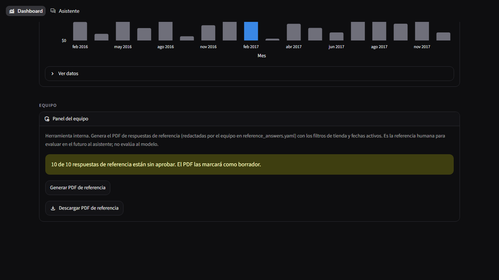
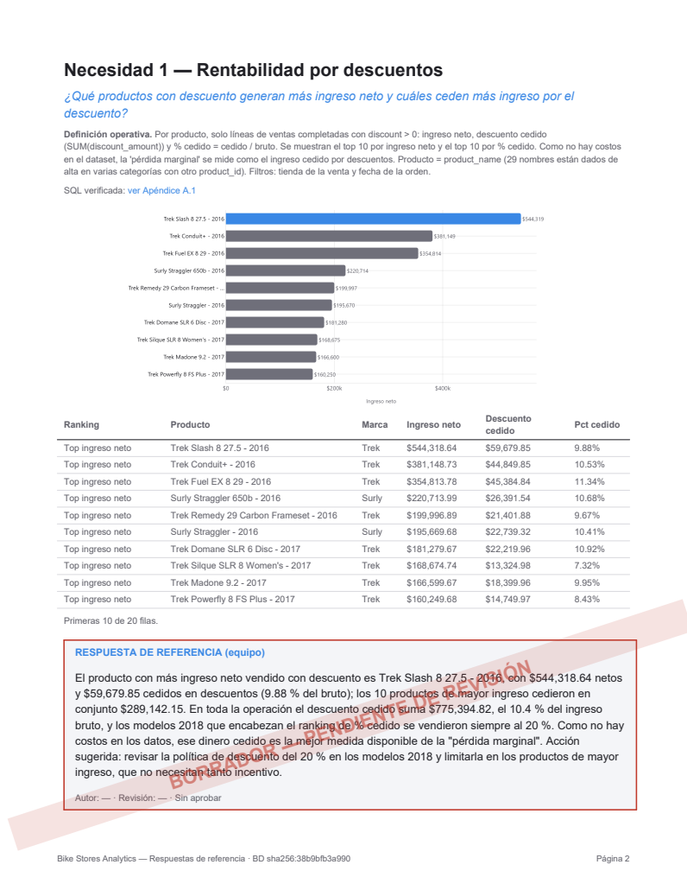

# Fase 6: PDF de respuestas de referencia (ground truth)

**Objetivo:** un documento con las respuestas "reales" a las 10 necesidades, redactadas
por el equipo y no por el LLM, que sirva en el futuro para evaluar las respuestas del
asistente. **En esta fase no se compara nada contra el chat**; solo se genera la referencia.

---

## 1. Archivos

| Archivo | Qué es |
|---|---|
| `reference_answers.yaml` | **El archivo que edita el equipo.** Por cada necesidad N1–N10: `pregunta`, `respuesta_referencia`, `autor`, `fecha_revision` y `aprobado` |
| `reference_report.py` | `generar_pdf_referencia(store=None, date_from=None, date_to=None) -> bytes`, sin Streamlit, más la CLI |
| `views/dashboard.py` | Expander **"Panel del equipo"** al final del Dashboard, en la sección "Equipo" |
| `tests/test_reference_report.py` | 6 pruebas (ver §5) |
| `reportes/` | Carpeta de salida de la CLI (ignorada por git) |

Dependencias nuevas: `reportlab` (el repo no tenía ninguna librería de PDF y esta no
necesita navegador), `kaleido` (exporta a PNG las gráficas Plotly) y `pyyaml`. En
desarrollo: `pypdf` (las pruebas extraen el texto del PDF) y `pypdfium2` (renderiza
páginas para las capturas). Al cambiar `requirements.txt`, el próximo arranque con
`ejecutar.bat` reinstala las dependencias una vez.

## 2. Cómo se generó el borrador

Claude Code escribió a mano, sin el LLM de Ollama, las 10 `respuesta_referencia`, usando
**solo cifras ya validadas** en fase2.md §4.2, `demo/cifras_clave.md` y las frases de
`analytics.insight`. La única cifra derivada es "Baldwin mueve siete veces más órdenes que
Rowlett" (1,019 / 142 = 7.2). Cada borrador tiene 3–5 frases: la cifra principal, por qué
importa para el negocio y una acción posible. Todas quedan con **`aprobado: false`**, y el
archivo empieza con un comentario de advertencia muy visible.

Son un **punto de partida**, no la referencia. El análisis y la recomendación los debe
escribir el equipo con sus palabras.

## 3. Instrucciones para el equipo: editar y aprobar

1. Abre `reference_answers.yaml` con cualquier editor de texto (VS Code, Notepad++…) y
   **guárdalo en UTF-8**.
2. Para cada necesidad:
   - Reescribe `respuesta_referencia` con palabras propias. Conserva el `|` y la sangría de
     4 espacios en todas las líneas del texto.
   - Si quieres ajustar la pregunta, cambia `pregunta` (siempre entre comillas).
   - Pon el nombre en `autor` y la fecha en `fecha_revision` con formato AAAA-MM-DD
     (por ejemplo `"2026-10-01"`).
   - Cuando esté revisada, cambia **`aprobado: false` por `aprobado: true`**.
3. Regenera el PDF desde la carpeta del proyecto (en un par de segundos si ya existe la
   caché de gráficas; ~30 s la primera vez):
   ```bash
   python reference_report.py
   ```
   Queda en `reportes/referencia_bikestores_<fecha>.pdf`. Opciones: `--tienda "Baldwin Bikes"`,
   `--desde 2017-01-01`, `--hasta 2017-12-31`.
4. También se puede generar desde la app: **Dashboard → al final, sección "Equipo" → Panel
   del equipo → "Generar PDF de referencia" → "Descargar PDF de referencia"**. Usa la tienda
   y las fechas elegidas arriba en el Dashboard.
5. Mientras quede alguna necesidad con `aprobado: false`, su recuadro lleva la franja
   **"BORRADOR — PENDIENTE DE REVISIÓN"** y la portada dice cuántas faltan. Si el YAML queda
   mal formado (sangría o comillas), el Panel del equipo muestra el error sin romper el
   dashboard y la CLI indica qué necesidad o campo falta.

**Importante:** las respuestas describen el **periodo completo con ventas (ene 2016 – mar
2018) y todas las tiendas**. Si el PDF se genera con filtros, cambian las gráficas y tablas,
pero no el texto.

> El botón es **solo para el equipo**: está en un expander aparte al final del Dashboard,
> no aparece en la página Asistente y no toca el flujo del chat.

## 4. Contenido del PDF

- **Portada:** título "Bike Stores Analytics — Respuestas de referencia", `[Nombre 1] ·
  [Nombre 2]`, fecha de generación, periodo y tienda analizados, sha256 de la BD, la nota
  "Este documento es la referencia humana para evaluar en el futuro la precisión del
  asistente conversacional. No es una evaluación del modelo de IA." y el conteo de
  respuestas sin aprobar.
- **Una página por necesidad (N1–N10):**
  1. "Necesidad N — título" y la pregunta, del YAML.
  2. La definición operativa de `business_queries.py`, en texto pequeño.
  3. Un enlace interno a la SQL en el **Apéndice A.N**.
  4. La gráfica del dashboard (`ui/charts.py`) exportada a PNG con `fig.to_image`. Se
     adapta al papel: fondo blanco, texto oscuro y el **mismo acento `#3987e5`** en el
     elemento destacado.
  5. Una tabla con las primeras 10 filas, con el mismo formato de moneda y porcentaje del
     chat y el dashboard.
  6. El recuadro **"RESPUESTA DE REFERENCIA (equipo)"**, con autor, revisión y estado. Si
     no está aprobado, lleva una franja diagonal roja semitransparente con "BORRADOR —
     PENDIENTE DE REVISIÓN", que se ve al imprimir.
- **Apéndice A:** las 10 consultas SQL verificadas, con los filtros ya incrustados, en
  letra monoespaciada.
- **Pie de página:** número de página y hash corto de `bikestores.db`, para saber contra
  qué datos se generó.

Con el YAML actual el PDF tiene 14 páginas (portada, 10 necesidades y 3 de apéndice) y
unos 670 KB.

## 5. Pruebas (`pytest -q`: 277 passed)

`tests/test_reference_report.py`:
- El YAML tiene exactamente N1–N10 con los 5 campos y lleva el aviso al inicio.
- Un YAML incompleto da un error claro.
- **PDF en borrador:** el texto extraído con pypdf contiene la portada, la nota, "10 de 10…
  sin aprobar", las 10 necesidades, 10 recuadros, al menos 10 franjas "PENDIENTE DE
  REVISIÓN", el hash en el pie y el apéndice SQL.
- **PDF aprobado** (YAML temporal con `aprobado: true`): sin marcas de borrador y con el autor.
- **Con filtros** (Rowlett, 2017): el periodo y la tienda aparecen en la portada y en la SQL.
- **AppTest:** el Dashboard muestra el aviso y el botón genera el PDF y el botón de
  descarga sin excepción.
- **No hay ninguna comparación contra el LLM:** queda para una fase futura.

## 6. Capturas

Panel del equipo (Dashboard → sección "Equipo"), después de generar:



Página de N1 en el PDF, con la franja de borrador porque el YAML sigue sin aprobar:



## 7. Problemas encontrados y resueltos

| Problema | Corrección |
|---|---|
| Las gráficas del dashboard son para fondo oscuro (texto claro) | `_print_figure`: misma figura con fondo blanco, texto oscuro y el mismo acento |
| En N1, N2 y N6 el recuadro de referencia se iba a la página siguiente | Gráfica de hasta 6.2 cm de alto, 10 filas en la tabla y columnas con ancho según su contenido (los montos ya no se parten) |
| Las etiquetas del eje X quedaban cortadas en el PNG | Margen inferior propio para la exportación |
| Exportar 10 gráficas con kaleido tarda ~30 s | Caché de PNG por necesidad + filtros + hash de la BD: regenerar con los mismos datos es inmediato. Las pruebas bajaron de 125 s a 65 s |

## 8. Notas

- **kaleido 1.x usa el Chrome o Edge instalado** en el equipo; aquí funcionó sin
  configuración. En un equipo sin navegador basado en Chromium, instala uno o ejecuta una
  vez `plotly_get_chrome`, que viene con plotly.
- **Consumo de tokens:** esta fase se completó sin un consumo anómalo, así que no hubo que
  abandonarla. El mayor gasto fueron las 3 iteraciones de maquetación del PDF, que se
  revisaron renderizando solo la página 2, y la suite de pruebas, que genera el PDF 4 veces.
